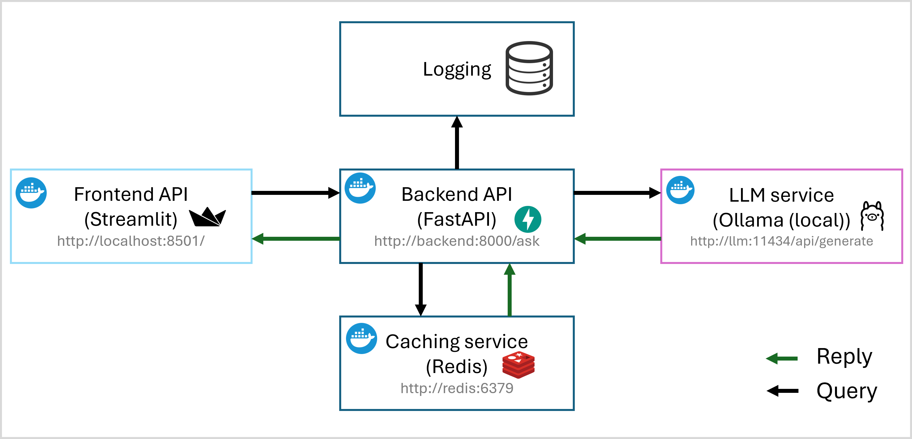
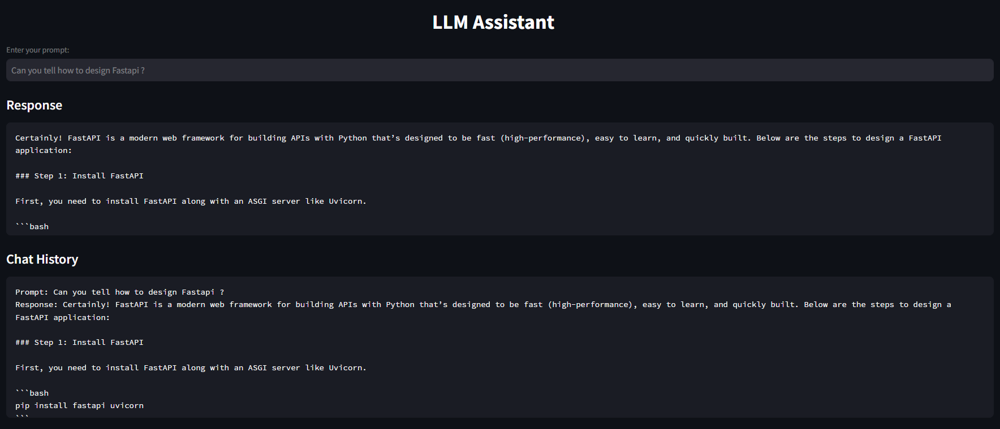

## LLM Web application using Ollama

### Introduction

This repository contains a web application that allows users to interact with large language models (LLMs) through an intuitive interface. The application is built using Streamlit, a Python library for building data applications. It connects to an Ollama backend server, which provides access to various LLMs.

### Features

- **User Interface**: A simple and intuitive interface for users to input queries and receive responses from LLMs.
- **LLM Selection**: Users can select different LLMs available on the [Ollama](https://ollama.com/search) backend server.
- **Inference Speed**: The application leverages Docker Compose to run the frontend and backend services, which can be optimized for faster inference using GPU support if available.
- **Cache**: Redis is used as a caching mechanism to store frequently accessed queries and responses, reducing redundant computations.

### Preview
Application Architecture |
:-------------------------:

Frontend Interface |
:-------------------------:

### Prerequisites
- Docker
- Docker Compose 
- GPU support for faster inference if you have one available.
  
### Installation and Usage

1. Clone the repository: `git clone git@github.com:gaurav00700/OllamaWebApplication.git`
2. Navigate to the project directory: `cd OllamaWebApplication`
3. Run the docker-compose command to start the application: `docker-compose up -d` 
   
   (Change the LLM_NAME in `.env` file according to your preference.)